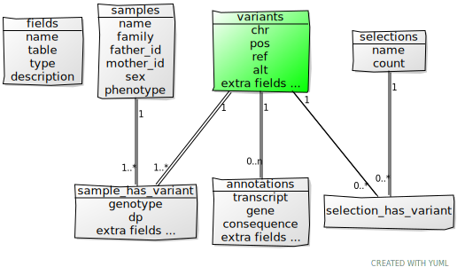

# Database schema 

Variants data are stored into normalized tables as follow.
The database shema is dynamically built according VCF input. That is, columns from **variants**, **annotations** and **sample_has_variant** tables are created on the fly.

#### Fields table 
Contains a description of all fields available in cutevariant database. 
Each field has a:

- Name : a short name - *(gene)*
- table: variants, annotations or samples - *(annotations)*
- type: int, float, str, bool e.g - (str)
- description: Readed from VCF header - *(the gene name)*

#### variants table
Contains information about the variant. It corresponds to one line from the VCF file. `chr`, `pos`, `ref`, `alt` are mandatory. All fields from VCF info field will be stored here.

!!! note
cutevariant decomposes multiallelic variant like [vt decompose](https://genome.sph.umich.edu/wiki/Vt#Decompose). One line with a multiallelic variant like `A>C,T` will have 2 records in the variants table `A>C` and `A>T`. 

#### annotations table
Contains information about a transcript. One variant may have multiple transcript information. It corresponds to the *ANN*, *EFF* or *CSQ* fields generated by [SnpEff](http://pcingola.github.io/SnpEff/se_inputoutput/#vcf-output) and VEP. For instance, transcript name, gene name and consequence are stored here. We implementes this feature using [the VCF annotation standard](https://pcingola.github.io/SnpEff/adds/VCFannotationformat_v1.0.pdf) 

#### samples table 
Samples are stored here with their pedigree relation comming from a ped file. This table is in a *many-to-many* relation with the **variant** table trough the **sample_has_variant** table.
The **sample_has_variant** table give the genotype for one variant and one sample. Extra fields from VCF file FORMAT section are stored here. 

#### selections table
Selection are subset of variant. It is connected to the **variant** table through the **selection_has_variant** table which contains id of selected variants.

