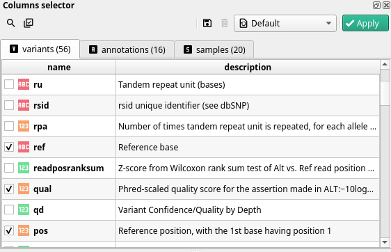
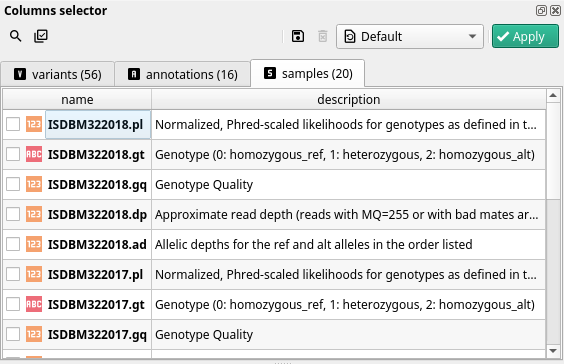

Selecting the fields you want to work with is the first step in cutevariant once the project is opened.

Every field you select will appear in the variant view as a single column.

For instance, using the cutestyle, genotype fields will appear as :material-circle-outline: for homozygous ref, :material-circle-half-full: for heterozygous, :material-circle: for homozygous alt and :material-circle-off-outline: for unknown genotype (*i.e.* the variant was not found).

## Field categories

One field in cutevariant represents one column in the variant view. But due to the structure of variant information, fields fall into three categories.

### Variants
Fields in this category contain information about the variant itself. In these fields you will find information to identify the variant, such as its
position on the chromsome (starting at 1), the chromosome the variant was found in, as well as the reference nucleotide(s) and its alternative allele.

!!! note
    One variant corresponds to one locus with one allele.

### Annotations

Because DNA is transcripted to RNA, one variant can have consequences on one or more transcript(s). The annotations category reflects that, meaning that there should be as many annotations fields as there are transcripts at the given locus. This information comes from the VCF file and is not computed by cutevariant itself.

!!! tip
    If you want to know if a variant has several annotations associated with it, you can do so by checking, in the variants category, a field called <kbd>annotation_count</kbd>

!!! info
    As shown in the above screenshot, in the fields widget, the field names are not prefixed with ann. However, when working with filters you have to keep in mind that every field you see in this category is called `ann.field_name`
### Samples

With every variant, and its related effects, comes the set of samples in which it was found upon sequencing. One of the most widely used information about each sample is its genotype (field called `samples.{sample name}.gt`), one of:

- unknown, when the locus was not found in this sample(:material-circle-off-outline:)
- homozygous for ref (:material-circle-outline:)
- heterozygous (:material-circle-half-full:)
- homozygous for alt (:material-circle:)

However, genotype is not the only field you can find in the samples category.
You can also find, depending on the VCF generation:
- allele sequencing depth
- total sequencing depth
- allele frequency 

