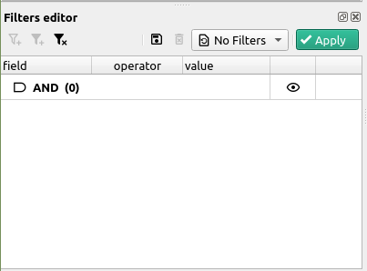

# Using filters

Filters are one of cutevariant's key features to select variants based on their properties.

In this tutorial, we will show you how to use the dedicated user interface.

## Filtering using the Filters editor plugin

To make filtering easier if you don't want to type in complex VQL statements, we provided you with a tree-based filter editor.

First, if you don't see the filters editor plugin, this may be because it's hidden. To show it, toggle its visibility in the top toolbar, you can see it with the :material-filter: icon.

This is what the window should look like now:

Once you have the plugin opened, you will see a tree view with only one root item. This item represents the root of the filter, which means that everything you will add as child items will be chained with `AND` statements. Among these child statements, you can in turn add `OR` or `AND` statements.

If you'd like to change any `AND` statement into an `OR`, you can do this by simply double-cliking the item and selecting the logical operator.

Once you're happy with the filter you just set, you can simply hit the <kbd>:material-check:Apply</kbd> button on the right.

If you'd like to set the filter as a preset, you can do so by pressing <kbd>Save as preset</kbd> in the dropdown menu of the plugin.

[^1]: This is a general remark, the whole point of cutevariant is to narrow down a selection of variants, as much as you can, and with the maximum amount of information.
