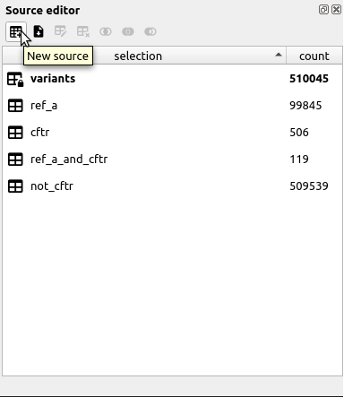

Selections in cutevariant are used to create new source tables that you can query your variants from.

There are three main ways to create a selection, they are listed below.

## Create source from current selection

In the variant view, you can see the results of your query. If you've just ran a query that took some time to compute, there is a way to save all the variants that got selected, so you won't have to wait again.

To save a selection, just click the 'new source' button in the source editor.

## Create source from intersection with a BED file

You can also create sources from a BED file. These files are just tab seperated text, where the first column identifies the contig ID (*i.e.* the chromosome name usually), and the next two columns indicate the range the feature is in (the latter is decribed by every following column).

Creating an intersection with a BED file means that you will deselect variants that fall outside the features described by the BED file, and save it to a new table.

## Create source from set operations with others

If you've selected interesting variants into two separated sources, then you can combine these two by using available set operations. There are three set operations: intersect, union, and difference. Please keep in mind that the latter is not symetrical, so the resulting table will depend on the order you applied the operation.

!!!note
    Because set operations on sources need exactly two sources to be valid, the associated actions are disabled if the number of selected sources is not exactly two.

### Intersect

If you need a new source that contains variants that are **both** in source A **and** in source B, you can create an **intersection**.
To do so, just select source A and source B, then press the :material-set-center:button in the toolbar. You can also right click the selected source.

You will be prompted for a name for the resulting selection. Please wait while this operation is running, for now it is blocking.

### Union

If you need a new source that contains variants that are **either** in source A **or** in source B, you can create a **union**.
To do so, just select source A and source B, then press the :material-set-all:button in the toolbar. You can also right click the selected source.

You will be prompted for a name for the resulting selection. Please wait while this operation is running, for now it is blocking.

### Difference

If you need a new source that contains variants that are in source A **but not** in source B, you can create a **difference**.
To do so, just select source A and source B, then press the :material-set-left:button in the toolbar. You can also right click the selected source.

You will be prompted for a name for the resulting selection. Please wait while this operation is running, for now it is blocking.

!!!warning
    Please be aware that this operation is not [commutative](https://en.wikipedia.org/wiki/Commutative_property){target=_blank}. This means that source A \ source B ≠ source B \ source A.

!!!tip
    You might do it without thinking about it, but the order of the operands is given by the order you selected the sources in the table view.
    Be also aware that if you right click back to the first item you selected, cutevariant will consider this one to be the last index selected, and you will end up with an unexpected operation order. 