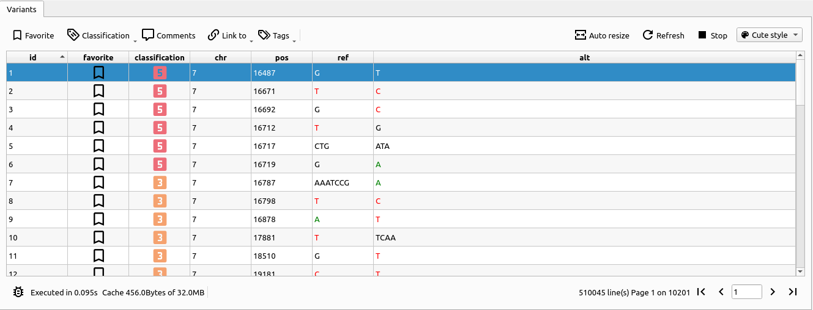

# What is the variant view?

The variant view is a table view where each line represents a variant, described by the columns.
This plugin is, along with the [VQL editor](vql-editor.md), one of cutevariant's main feature, that displays all the variants selected by a VQL select query.

# Using the variant view

The variant view is divided into three main parts: the tool bar, the table view, and the page buttons.

## The toolbar

The toolbar gives you a quick access to the view's actions.

### Favorites

Toggles the 'favorite' status of the selected variant. If several variants are selected, pressing this button will switch the state of the last selected variant, and every other selected variant will have the same.

### Classification

Sets the [ACMG classification](https://www.ncbi.nlm.nih.gov/pmc/articles/PMC4544753/){target=_blank} for all the selected variants.

### Comments

Edits comments with a side panel as shown below (TODO: take a screenshot of a feature that has not been implemented yet)

### External links

From the table view, you can select one or more variants and open a web link to it. The list of possible links to open, as well as the default one to choose on double click, are configurable within the settings of the variant view.

### Tags

In Cutevariant, you can assign one or more tags to the selected variants. Just like comments and favorite status, they have an associated column in the database.

### Display options

After the query is done, you can press :material-table-split-cell:`auto-resize` so that the columns will automatically adapt to the content width.

There is also a feature to refresh the variant view, or stop it if you think it is taking too long and need to make another query.

On the very right, you can choose the display style, for now there is only `no style` and `cutestyle`. We recommend `cutestyle` over `no style`, since it will display some special fields with a more user-friendly look.

## The table view

This is the main view of the plugin. Each line corresponds to one variant, and each column represents a [field](fields.md). If one or more of the selected fields are annotation fields, then a single variant will result in as many lines as there are transcripts at the given locus.

## The page buttons

At the bottom-right of the plugin widget, you will see the number of lines that were selected, as well as the total number of pages it represents.
This comes with standard navigation buttons: first, last, previous, and next page.
