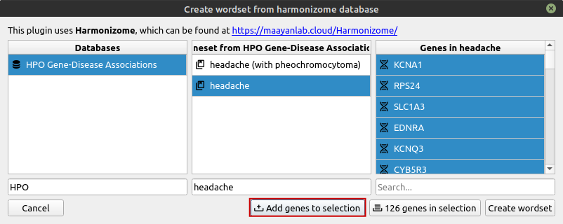
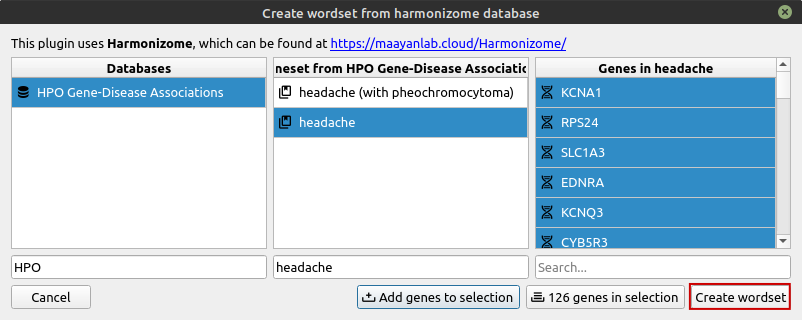

# Using wordsets

In Cutevariant, wordsets are named collections of text data. They are uesful in filter requests, either in the 'WHERE' part of a [VQL statement](../vql) or in the [filters editor](/filters). Text fields (:material-alpha-s-box: in the fields editor), can be tested against wordsets.

For instance, if you are looking for variants in a specific gene set, then all you need is to create a wordset containing the names of all the genes you are intersted in, and selecting variants where the ann.gene field matches one of the genes in the wordset.

# Harmonizome tutorial

Here is an example of how you can generate a wordset, using the harmonizome plugin.

In this example, let's assume you have an exome at your disposal, and that you know what the patient suffers from.

[Harmonizome]((https://maayanlab.cloud/Harmonizome/)) is a great database that references, to date, 114 gene ontology databases. Among them, Reactome pathways, HPO gene-disease association or KEGG pathways just to name a few. These databases all provide association between an 'attribute' and a gene name (see the [about](https://maayanlab.cloud/Harmonizome/about) page on harmonizome website). This makes it very useful to reliably create gene sets, making sure that you always get gene names for the attributes you are looking for.

## Step 1 - Find the symptoms in HPO database

Let's say your patient has headache. Open up the harmonizome plugin (Tools/Create wordset from harmonizome database...), and search for 'HPO' in the dataset searchbar.

[!Open harmonizome plugin, search for 'HPO'](../images/harmonizome_step_one.png)

Now, if you type in 'headache' in the second searchbar, it will look for the name of the symptom.

!!! note
    This is only true for HPO, gene-disease association. Other databases refer to gene sets using their own toponymy.

Now that you've searched for 'headache', you will end up with several list items with the complete name of the symptom. If you click on one of them, you will find another list view with the list of genes associated with the symptom, according to HPO database.

[!Search for 'headache' in HPO database. Genes are on the right](../images/harmonizome_hpo_search_headache.png)

## Step 2 - Select the genes from the resulting set

In the previous step, we just saw how you can search for a gene ontology database, then selecting a gene set according to the phenotype you observe in your sample. In this step, we will guide you through the generation of the wordset itself, using the harmonizome plugin.

As you can see below, you can select all the genes you wish in the rightmost view, using <kbd>Ctrl</kbd> + <kbd>A</kbd>.

[!Select genes from geneset](../images/harmonizome_select_genes.png)

With those genes selected, you can add them to the selection using the button as shown below.

Once you've added the genes to the selection, you can repeat any of the previous steps, as many times as you may need. For example, you may want to select another geneset from the same database, or even choose from another dataset.

!!! note
    Every time you add genes to the set, if the same gene is already in the selection, it will not be added (there are no doubles)

Now, when you're happy with your selection, you can create a wordset that will contain every gene in the selection, by pressing the button as shown below.

This will open a simple text prompt so that you can name the wordset as you like.

You're done! What you can do next is use the generated wordset as indicated here and here.