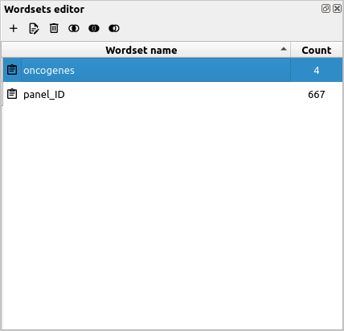

# Why use wordsets?

In Cutevariant, wordsets are named collections of text data. They are useful in filter requests, either in the 'WHERE' part of a [VQL statement](../vql.md) or in the [filters editor](filters.md). Text fields such as ann.gene or ann.consequence(:material-alpha-s-box: in the fields editor), can be tested against wordsets.

For instance, if you are looking for variants in a specific gene set, then all you need is to create a wordset containing the names of all the genes you are intersted in, and selecting variants where the ann.gene field matches one of the genes in the wordset.

[Here](harmonizome.md) is a complete tutorial on how to do this with a dedicated plugin called harmonizome.

# Wordset plugin

Wordsets, just like every other feature in cutevariant, are stored in the project file (a sqlite3 database as explained [here]()).

The wordset plugin is where you can organize all the wordsets you defined for your project. It should look something like that:

As you can see, wordsets can be added (:material-plus:), edited (:material-file-edit:) and deleted (:material-trash-can-outline:).

When adding or editing a wordset, a dialog will popup so you can manually edit data in the wordset.

However, we now that manual editing can be tedious, and this is why the plugin comes with an 'import from file' feature. You can either find it in the wordset editing dialog (this will prompt you for a text file), or you can directly drag and drop the file from your desktop. In the latter case, the wordset will be named according to the file that you've dropped.

!!! note
    Whether you import the file from the dialog or from a drag and drop, the input file should contain one word per line with no space (lines with space will be ignored!)

# Set operations

Now that we've covered the basics of wordsets, let's go deeper and see how to create wordsets from boolean operations.

As a general idea, these operations allow you to create new sets from any number of existing ones. Here is how in detail.

## Union

This is the operation you need if you need to join two or more wordsets. It's basically an 'add' operation between every selected wordset.
To apply a union operation, just select every wordset you'd like to perform the union of, and press the :material-set-all: button.

This will prompt you for a new wordset name.

!!! note
    The number of resulting words in the newly created wordset might be less than the sum of the word counts in the starting sets. This is because of the unicity of elements in a set: there will be no doubles. See [wikipedia](https://en.wikipedia.org/wiki/Union_(set_theory)){target=_blank} for more info.

## Intersection

As the name suggests, the intersection will give you elements that are present in all selected wordsets.
To apply an intersection operation, just select every wordset you'd like to perform the intersection of, and press the :material-set-center: button.

Just like the union operation, it will prompt you for a new wordset name.

!!! note
    If you select many wordsets to intersect, they are more likely to give you an empty set.
    See [wikipedia](https://en.wikipedia.org/wiki/Intersection_(set_theory)){target=_blank} for more info.

## Difference

This one is a bit more tricky than the other two. In fact, while union and intersection operations are commutative, this one is not.
This means that A\B ≠ B\A. However, the operation A\B\C\D is equivalent to A \ ( B ∪ C ∪ D ). So in our case, the only thing that matters is that you select the right wordset as first operand.

To put it in practice, let's say you need a new wordset with elements from A that are neither in B, nor in C, nor in D.
In such case, you would select A first, all the other ones in any order, and press the :material-set-left: button.

See [wikipedia](https://en.wikipedia.org/wiki/Complement_(set_theory)#Relative_complement){target=_blank} for more information about this operation.

# Using wordsets in filters

## Drag and drop

Cutevariant comes with some drag and drop features between its plugins. Concerning the wordset plugin, this means you can drag the wordset name from the list, and drop it to a condition in the [filters editor](filters.md). If the condition is already set with a field, dropping a wordset on it will automatically fill the condition with the 'IN WORDSET' operator (using the dropped wordset as the value).
Otherwise, if you drop the wordset to a logical field (AND or OR), then it will create a condition on the ann.gene field and testing 'ann.gene IN WORDSET['{wordset name}'].