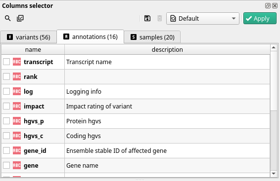

Selecting the fields you want to work with is the first step in cutevariant once you've loaded a project in.

Every field you select will appear in the variant view as a single column. Depending on the field, you may see some decoration (at least with the cute style).

For instance, genotype fields are styled with :material-circle-outline:,:material-circle-half-full:,:material-circle: and :material-circle-off-outline:

## Field categories

One field in cutevariant represents one column in the variant view. But due to the structure of variant information, the fields fall into three categories.

### Variants
Fields in this category represents the variant itself. In these fields you will find information to identify the variant, such as its
position on the chromsome (starting at 1), the chromosome the variant is in, the reference nucleotide(s) and the alternative allele considered. You will
find about quality, read depth, and several flags that may help you determine the type of variant you are considering.

:material-information: One variant corresponds to one locus with one allele. Fields in this category never contain information about one specific transcript. Even though some annotation tools might indicate scores for predicted impact(s), these fields **don't** apply to one given t

### Annotations
Each field in this category contains information about one transcript, associated with a unique variant. This means that one variant can have several sets of annotations, one per transcript. In this case, the same variant will appear several times in the variant view, as many times as there are transcripts.

:material-information: If you want to know if a variant has several annotations associated with it, you can do so by checking, in the Variants category, a field called <kbd>annotation_count</kbd>

:material-notebook: As you can see below, in the fields widget, the field names are not prefixed with ann. However, when working with filters you have to keep in mind that every field you see in this category is called `ann.field_name`

### Samples

With every variant, and its related effects, comes a set of samples in which it was found upon sequencing. One of the most widely used information about each sample is its genotype (field called `samples.{sample name}.gt`), one of:

- unknown, when the locus was not found in this sample(:material-circle-off-outline:)
- homozygous for ref (:material-circle-outline:)
- heterozygous (:material-circle-half-full:)
- homozygous for alt (:material-circle:)

However, genotype is not the only field you can find in the samples category.
You will also find, among others, the sequencing depth at the specific locus for each sample. This can give you some information about confidence considering zygoty (the lower the read depth, the lower the confidence).

