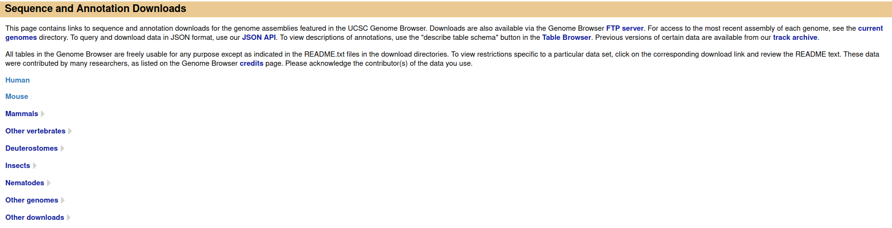
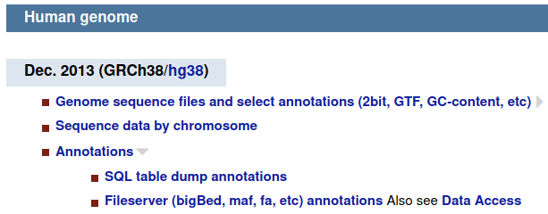

The gene viewer plugin requires annotation files, which can be downloaded from UCSC.

Here is a step-by-step tutorial on how to download and setup the gene viewer so you can see annotations with the same ontology as the one that was used to produce your VCF.

# Introduction

The gene viewer is a cutevariant plugin that displays the variants that you selected in the context of their associated gene.

In order for this plugin to display annotations correctly, you need to provide a database file with the same annotations as the ones provided in the 'gene' field of your VCF. This is done with the following steps

# Downloading an annotation reference file

You can find lots of reference annotation files at https://hgdownload.soe.ucsc.edu/downloads.html. Here is what it looks like as of May 2021 :

Choose the species you are interested in, then on to the 'annotations' section.

Click on SQL table dump annotations, which will lead you to this page:

If you know the name of the database you are looking for, you can search for its name (<kbd>Ctrl</kbd> + <kbd>F</kbd>) in firefox.

In our case, let's say we are looking for refGene annotations.

Be sure to download the `.txt.gz` file and not the `sql` one, as cutevariant only supports the zipped text file.

# Converting the .txt.gz file into a .db (sqlite3) database file

Luckily enough, cutevariant can convert the zipped text file that you downloaded in the previous step to a sqlite3 database. This is the file that you must provide to the gene viewer plugin under Settings/Gene viewer.

